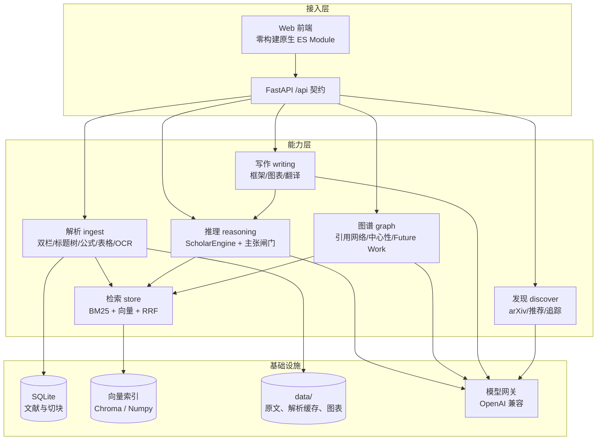

# 知微 ZhiWei · 溯源型全流程科研助手 Agent

> **科研助手不该「写得像」，而该「指得出」。**
>
> 我们把「抗幻觉」从提示词里的一句请求，做成了系统里的一个不变量：
> 任何一句结论，如果不能在原文里指出来，它就不许出现在答案里。

参加赛项：**传智杯 · 全国高校 AI 大模型挑战赛**
命题：**智领科研 · 意图驱动：基于大模型与 Agent 架构的全流程科研助手构建挑战赛**

---

## 一、这个项目解决什么问题

通用 Chatbot 在科研场景里最致命的问题不是「答得不好」，而是**答得像真的**。
一篇论文里的「8 张 P100、12 小时、28.4 BLEU」被模型随口改成「16 张 V100、7 天、41.0 BLEU」，
读起来毫无破绽，但这是不可接受的。

所以知微的设计目标不是「更会写」，而是**每一句话都能点回 PDF 的某一页某一句**。
做不到就明确说「证据不足」，而不是给一个看起来合理的答案。

### 三个可验证的设计主张

1. **风险与价值是两根轴，不是一个总分。**
   我们不输出「这段话可信度 0.83」这种糊在一起的数字，而是给出**类型化裁决**
   （`放行 / 待核实 / 拦下`）和**可读的理由**。理由能被人复核，分数不能。
2. **参考文献不由模型写。**
   模型只负责回答「这句话该引用库里的第几篇」，引用串由文献元数据拼装。
   库中没有的文献，**物理上不可能**被引用出来。
3. **拦不下的东西，会被标出来。**
   闸门判不了的情况（例如中文主张对英文原文）会明确标注「离线裁判无法判定」，
   而不是假装判了个低分。宁可多说一句「待核实」，也不假装确定。

---

## 二、核心机制：主张闸门（Claim Gate）

闸门是整套系统的心脏，位置在「模型生成」和「输出给用户」之间。每一句主张都要过三道硬检查 + 一道软检查：

| 检查 | 类型 | 判据 | 不通过时 |
| --- | --- | --- | --- |
| 有没有证据 | 硬 | 主张必须带至少 1 条原文引文 | 直接拦下 |
| 引文能否在原文定位 | 硬 | 引文必须能在 PDF 原文里逐字找到 | 直接拦下（疑似编造出处） |
| 数字是否一致 | 硬 | 主张里的每个数字都要在引文里出现 | 直接拦下 |
| 证据是否足以支撑 | 软 | 词面支撑度 + 术语覆盖度 + 裁判蕴含分 | 按综合分划线 |

综合分 = `0.55 × 蕴含分 + 0.25 × 词面支撑度 + 0.20 × 引文定位率`，
高于放行线放行、低于拦下线拦下、中间降级为「待核实」。

**这三道硬检查全部是纯词法、离线、可复现的** —— 不依赖模型、不依赖网络，
所以「有没有编造出处」这件事，在任何环境下都能被判死。
只有第四道软检查交给了可替换的裁判（离线词法裁判 / 模型裁判 / 两者混合）。

### 阈值不是拍脑袋定的

`evals/` 下有一份 39 条人工标注的评测集（放行 / 待核实 / 拦下），
以及一个阈值扫描脚本。当前结果：

| 阈值 | 宏平均 F1 | 准确率 | 拦下召回 |
| --- | --- | --- | --- |
| 默认 0.35 / 0.75 | 0.916 | 0.923 | 1.00 |
| 标定 0.20 / 0.85 | **0.975** | **0.974** | 1.00 |

复现：`python evals/calibrate.py`（不需要任何 API key）。完整网格见 [`evals/report.md`](evals/report.md)。

代码里的默认值是偏保守的那一档；标定最优怎么用起来，写在 `.env` 里即可（不写就用默认）：

```bash
ZHIWEI_GATE_BLOCK_AT=0.20
ZHIWEI_GATE_ALLOW_AT=0.85
```

闸门启动时会校验 `0 <= block_at < allow_at <= 1`，配反了直接拒绝启动，不会静默跑歪。

---

## 三、赛题六大模块的落地情况

| # | 赛题要求 | 知微的实现 | 代码位置 |
| --- | --- | --- | --- |
| 1 | PDF 管理与细粒度解析、语义级去重 | 双栏阅读顺序识别、标题树、表格 / 图 / 公式抽取、**正文指纹语义去重（不看文件名）**、版本族谱与差异 | `zhiwei/ingest/` |
| 2 | 抗幻觉 RAG 与多文推理 | 混合检索（BM25 + 向量 + RRF 融合）→ 逐句生成 → **主张闸门逐句裁决** → 原文锚点 | `zhiwei/reasoning/` |
| 3 | 版式感知阅读与双向联动翻译 | 标题树定位、块级文本层、`[11]` ↔ 参考文献双向无损跳转、中英对照联动 | `web/js/views/reader.js` |
| 4 | 自动检索、追踪与智能推荐 | arXiv / OpenAlex / Semantic Scholar 检索下钻、**引用含金量筛选剔除应付式引用**、四维加权推荐 + 开源代码加分、定期追踪 | `zhiwei/discover/` |
| 5 | 引用图谱挖掘与学术综述 | 引用网络构建 → PageRank / 中介中心性 / k-core → **基石 / 桥接 / 衍生 / 孤岛**角色判定（每种都给人话理由）→ 图谱下游的自动综述 → **Future Work 时效性判定** | `zhiwei/graph/` |
| 6 | 学术写作与可视化 Copilot | Idea → Abstract / Introduction / Related Work 框架 + **无幻觉 References**；Mermaid / Graphviz / TikZ 生成；CSV → 图表 + 自动 Figure Caption | `zhiwei/writing/` |

### 几个具体的设计取舍

### Agent 层：不是「一段固定流程」，是真的会规划、会调工具

赛题要的是 Agent，不是把六个功能并排放在页面上。所以知微的 Agent 层（`zhiwei/agents/`）是真的在循环：

```
规划 → 调工具 → 记观察 → 按观察再规划（最多补 2 步）→ 收尾过闸门
```

- **规划器**：把工具名册交给模型产出 JSON 计划；**名册里没有的工具一律丢弃**——规划器不许发明工具。
  没有密钥时退到确定性规则计划，所以离线环境里它仍然是 Agent，而不是一句报错。
- **工具箱**：8 个真实工具（库情盘点 / 混合检索 / 引用图谱 / 核心节点 / Future Work 时效 / 综述 / 写作框架 / 外部检索），
  每一个都接线到已有模块；工具失败不算崩，会变成一条带错误类型的失败观察。
- **工作记忆**：步骤留痕 + 按字符预算压缩 + 证据池去重。工具捞到的证据会汇总起来，
  最终答案收窄到真正相关的那几篇文献上。
- **收尾**：走同一个问答引擎，逐句主张照旧过主张闸门。Agent 新增的能力是「会去找」，不是「答案免检」。

每一步的 tool / 参数 / 耗时 / 结果都通过 SSE 推给前端的时间线，**不做黑盒**。
图谱那边同理：默认离线启发式分类（秒级出图），要模型精判引用意图时显式打开开关。

- **引文定位不到就返回 `None`，绝不做宽松到失真的模糊匹配。**
  这是闸门能拦住幻觉的地基。匹配放宽一点，整套溯源可信度就垮了。
- **跨语言核验要老实。** 中文主张对英文原文，词面重合度天然为 0。
  我们的做法是：用数字、单位、拉丁术语做锚点；判不了就明确返回
  `local_undecided`，交给模型裁判复核，而不是假装判了个低分。
- **检索用 RRF 而不是加权求和。** BM25 的分和向量相似度量纲不同，
  直接加权会让其中一路凭数量级压死另一路。RRF 只看名次，稳。
- **BM25 和向量器都是自己实现的离线版本。** 评审环境不能保证装得上依赖，
  更不能保证有网。有模型密钥时自动切到真向量，没有也能完整跑通。
- **剔除应付式引用。** 引用分 `background / extends / uses / compares / criticizes / lists`
  六种意图，`lists`（纯罗列）被判为应付式，在「只看实质引用」视图里会被剔除，
  图谱前后对比可见：`边 26 → 18` 这类变化。

---

## 四、快速开始

### 方式 A：看界面（不需要后端、不需要 key、不需要联网）

```bash
python tools/mock_server.py --port 8010
# 浏览器打开 http://127.0.0.1:8010/
```

纯标准库的假后端，六个页签、SSE 流式问答、图谱都能看到。

### 方式 B：完整跑通（需要 Python 3.10+）

```bash
pip install -r requirements.txt
cp .env.example .env        # 填入你自己的模型网关密钥

# 1) 下载演示论文（两版 Attention Is All You Need）
python tools/fetch_demo_papers.py

# 2) 命令行端到端跑一遍：入库 → 去重 → 问答 → 闸门 → 图谱 → 综述
python tools/demo_offline.py

# 3) 起 Web 服务
python run.py
# 浏览器打开 http://127.0.0.1:8000/
```

> 没有模型密钥也能跑：解析、检索、图谱、闸门硬检查全部离线可用，
> 只有「生成类」能力会降级为「只给可核验的原句」。

### 方式 C：测评闸门阈值

```bash
python evals/calibrate.py                 # 离线裁判
python evals/calibrate.py --judge hybrid  # 用模型裁判复核
```

---

## 五、架构



数据流的关键在于：**所有生成路径都必须穿过闸门**。
问答、抽取、对比、综述、写作框架，无一例外。

---

## 六、目录结构

```
research-copilot/
├─ run.py                    启动入口（后端 + 静态前端）
├─ zhiwei/
│  ├─ contracts.py           全系统的数据结构（锚点、证据、主张、裁决…）
│  ├─ config.py              配置（只从环境变量读，密钥不进代码）
│  ├─ llm/                   模型网关 + 全部提示词
│  ├─ agents/                Agent 层：规划器 / 工具名册 / 工作记忆 / 主循环
│  ├─ ingest/                PDF 解析、OCR、元数据、语义去重、版本差异
│  ├─ store/                 SQLite 文献库 + 混合检索索引
│  ├─ reasoning/             抽取锚点、主张闸门、问答引擎
│  ├─ graph/                 引用网络、中心性、综述、Future Work
│  ├─ discover/              arXiv/OpenAlex 检索、推荐、追踪
│  ├─ writing/               论文框架、图表、架构图、翻译
│  └─ api/                   FastAPI 路由 + 编排（契约冻结在 docs/api-contract.md）
├─ web/                      零构建前端（原生 ES Module + CDN 降级）
├─ tools/
│  ├─ mock_server.py         纯标准库假后端（无 key 也能演示）
│  ├─ demo_offline.py        命令行端到端演示
│  └─ fetch_demo_papers.py   拉取演示论文
├─ evals/                    闸门阈值标定：评测集 + 扫描脚本 + 报告
├─ docs/                     接口契约、任务书、技术文档
└─ tests/                    unittest（无需 pytest）
```

---

## 七、测试

```bash
python -m unittest discover -s tests -v
```

覆盖主张闸门的四道检查、跨语言核验边界、文献库与混合检索、引用条目解析（含作者串误判防护）。

---

## 八、技术选型与理由

| 选型 | 理由 |
| --- | --- |
| FastAPI | 原生支持 SSE（`StreamingResponse`），契约即文档；启动轻，评审环境一条命令可跑 |
| 零构建前端（原生 ES Module） | 不需要 npm / 构建产物。评审拿到仓库就能跑，没有「装不上依赖」这道坎 |
| SQLite + 自实现 BM25/向量 | 单文件数据库，无外部服务依赖；自实现是为了**在断网、缺依赖的环境里依然完整可用** |
| Chroma（可选） | 装了就用，装不上自动退回 Numpy 后端，不影响功能 |
| PyMuPDF + pdfplumber | PyMuPDF 快且能拿到字号/坐标（双栏与标题树的依据）；pdfplumber 表格更准，两者互补 |
| NetworkX | PageRank / 中介中心性 / k-core 都是成熟实现，图谱部分不重复造轮子 |
| 模型网关走 OpenAI 兼容协议 | 任意兼容网关可替换，不被单一厂商锁定 |

---

## 九、密钥安全

- 所有密钥只从环境变量读取（`zhiwei/config.py` 是唯一读取点）。
- `.env` 已在 `.gitignore` 中，仓库内不含任何真实密钥。
- `GET /api/health` 返回的配置摘要只暴露密钥**后四位**。
- 部署模板见 `Dockerfile` / `docker-compose.yml` / `.env.example`。

---

## 十、参赛信息

- 高校：待填写
- 队伍名称：待填写
- 队员与分工：待填写
- 指导教师：待填写
- 在线演示地址：待填写（部署后填入）

演示视频脚本见 [`docs/演示视频脚本.md`](docs/演示视频脚本.md)，
技术文档见 [`docs/技术文档.md`](docs/技术文档.md)。
提交物对照表（哪些材料对应哪个文件、还差什么）见 [`docs/提交材料清单.md`](docs/提交材料清单.md)。
