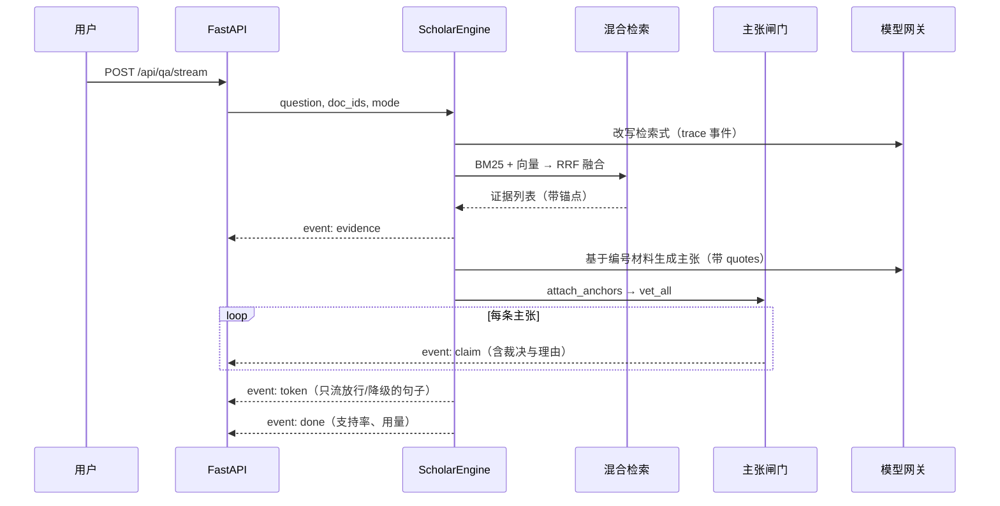

# 知微 ZhiWei 技术文档

**溯源型全流程科研助手 Agent**

参赛赛项：传智杯 · 全国高校 AI 大模型挑战赛 —「智领科研 · 意图驱动」

---

## 1 项目概述

### 1.1 一句话定位

知微是一个把「抗幻觉」做成**系统不变量**而非提示词技巧的科研助手 Agent：
任何一句输出到用户面前的结论，都必须携带可点击回到 PDF 原文的锚点，
否则它会被拦下或降级为「待核实」。

### 1.2 我们要解决的问题

科研场景对确定性的要求是极端的：一个被记错的超参数、一个被张冠李戴的 BLEU 分数，
都会直接导致错误的实验设计。而通用大模型恰好最擅长生成「读起来毫无破绽」的错误内容。

现有做法普遍是把「不要编造」写进系统提示词。这在工程上是**请求**，不是**保证**：
模型可以不听，而且不需要付出任何代价。

知微的出发点是：**把这件事从「请求」变成「检查」**。

### 1.3 设计原则

1. **可溯源优先于可读性**：宁可输出一句干巴巴的原文引用，也不输出一句流畅的二手总结。
2. **判不了就说判不了**：不确定的一律降级为「待核实」，绝不假装确定。
3. **离线可复现**：核心的「出处检查」必须是纯词法、可离线、可复现的，
   不能依赖模型或网络 —— 否则评委换了环境，你的抗幻觉就消失了。
4. **异常一律降级**：任何环节出错都走「更保守」的分支，绝不静默放行。

---

## 2 需求分析

### 2.1 科研流程中的真实痛点

| 阶段 | 痛点 | 知微的应对 |
| --- | --- | --- |
| 找文献 | arXiv 日均数百篇，重复版本（v1 与 v7）混在一起 | 正文指纹语义去重 + 版本族谱 |
| 读文献 | 双栏排版、公式、表格、扫描件，通用解析器读成一锅粥 | 版式感知解析 + OCR 回填 |
| 问细节 | 「用了几张什么卡训了多久」，答错了没人发现 | 逐句溯源问答 + 数字一致性检查 |
| 读跨语言 | 中英对照靠来回切换，引用标记跳不过去 | 双向无损跳转 + 对照联动 |
| 追进展 | 不知道某方向最新做到哪一步 | arXiv 追踪 + 推荐（带开源代码加分） |
| 理脉络 | 20 篇论文谁是谁的基础，说不清 | 引用图谱 + 中心性挖掘 + 角色判定 |
| 找空白 | 想做的点早被人做完了 | Future Work 时效性判定 |
| 写论文 | 引用靠手抄，容易张冠李戴 | **引用串由元数据拼装，不经模型** |

### 2.2 功能需求到实现模块的映射

| # | 赛题要求 | 知微的实现 | 代码位置 |
| --- | --- | --- | --- |
| 1 | PDF 管理与细粒度解析、语义级去重 | 双栏阅读顺序识别、标题树、表格 / 图 / 公式抽取、正文指纹语义去重、版本族谱与差异 | `zhiwei/ingest/` |
| 2 | 抗幻觉 RAG 与多文推理 | 混合检索（BM25 + 向量 + RRF）→ 逐句生成 → 主张闸门逐句裁决 → 原文锚点 | `zhiwei/reasoning/` |
| 3 | 版式感知阅读与双向联动翻译 | 标题树定位、块级文本层、`[11]` 与参考文献双向无损跳转、中英对照联动 | `web/js/views/reader.js` |
| 4 | 自动检索、追踪与智能推荐 | arXiv / OpenAlex / Semantic Scholar 检索下钻、引用含金量筛选剔除应付式引用、四维加权推荐 + 开源代码加分、定期追踪 | `zhiwei/discover/` |
| 5 | 引用图谱挖掘与学术综述 | 引用网络构建 → PageRank / 中介中心性 / k-core → 基石 / 桥接 / 衍生 / 孤岛角色判定 → 图谱下游的自动综述 → Future Work 时效性判定 | `zhiwei/graph/` |
| 6 | 学术写作与可视化 Copilot | Idea 到 Abstract / Introduction / Related Work 框架 + 无幻觉 References；Mermaid / Graphviz / TikZ 生成；CSV 到图表 + 自动 Figure Caption | `zhiwei/writing/` |

### 2.3 非功能需求

- **性能**：15 页论文解析 < 10s；检索响应 < 500ms；问答首字节 < 3s。
- **可复现**：`python tools/demo_offline.py` 一条命令跑完主链路。
- **可降级**：无模型密钥、无外网、无第三方向量库时，功能不消失、只降级。
- **安全**：密钥只走环境变量；公开接口不返回密钥；日志不打印密钥。

---

## 3 系统架构设计

### 3.1 分层

```
接入层   Web 前端（零构建）  ↔  FastAPI /api（契约冻结）
能力层   解析 · 检索 · 推理 · 图谱 · 写作 · 发现
基建层   SQLite · 向量索引 · 文件仓 · 模型网关
```

分层的强约束是：**能力层之间只能通过 `contracts.py` 里的数据结构通信**。
锚点（Anchor）、证据（Evidence）、主张（Claim）、裁决（GateDecision）
在全系统是同一套定义，前端渲染高亮框用的就是它。

### 3.2 关键数据流：一次提问



### 3.3 为什么把闸门放在「生成之后、输出之前」

如果放在检索阶段，你只能过滤材料、不能约束结论；
如果放在前端，绕过接口就能拿到未过滤内容。
放在服务端生成与输出之间，是唯一能同时满足「约束结论」和「不可绕过」的位置。

### 3.4 接口契约（摘要）

前后端共用 38 个接口，契约冻结在 `docs/api-contract.md`，字段名改动必须同步两侧。
按能力分组如下：

| 分组 | 代表接口 | 说明 |
| --- | --- | --- |
| 文献管理 | `POST /api/papers/upload`、`GET /api/papers`、`DELETE /api/papers/{doc_id}` | 上传即解析，返回去重决策与版本关系 |
| 版式阅读 | `GET /api/papers/{doc_id}/page/{page}`、`/references`、`/xref` | 页面块 + bbox、参考文献条目、引文双向定位 |
| 问答与推理 | `POST /api/qa/stream`（SSE）、`/api/extract`、`/api/compare` | 主张逐条推送，每条带裁决、置信度与锚点 |
| 图谱与综述 | `POST /api/graph/build`、`GET /api/graph`、`/api/survey`、`/api/future-work` | 图结构、角色理由、逐句可溯源的综述 |
| 发现与推荐 | `POST /api/discover/search`、`GET /api/recommend`、`/api/track/run` | 检索下钻、四维加权推荐、定时追踪 |
| 写作与可视化 | `POST /api/writing/outline`、`/diagram`、`/figure` | 框架生成、架构图、CSV 出图与 Figure Caption |
| Agent 编排 | `POST /api/agent/run`（SSE） | `plan / node / tool / claim / done` 事件流，前端渲染成执行时间线 |

所有生成类接口的返回值形状一致：`claims[]` 里每一条都含 `verdict`、`confidence`、`reasons`、`anchor`。
前端不需要为不同接口写不同的渲染分支，这是「契约冻结」带来的直接收益。

---

## 4 AI 技术方案

### 4.1 模型选型与理由

系统通过 OpenAI 兼容协议接入模型网关，不绑定单一厂商。默认配置：

| 用途 | 选型思路 | 理由 |
| --- | --- | --- |
| 复杂推理（问答、综述、对比） | 强推理模型 | 这些任务要求长上下文关联与多文推理 |
| 高频轻量（改写、路由、抽取） | 快速模型 | 单次成本低、延迟小，适合作为 Agent 的「反射」 |
| 视觉 OCR（扫描件 / 公式 / 图表） | 视觉语言模型 | 无文本层的 PDF 走视觉通道是唯一可行解 |
| 向量化 | 文本嵌入模型 | 用于语义召回，与 BM25 互补 |
| 学术翻译 | 机器翻译模型 | 术语一致性优于通用对话模型 |

选型原则是**按角色分工，而不是用一个最强的模型干所有事**：
改写检索式这种任务用最强模型是浪费，而综述生成用弱模型会直接产生无法溯源的句子。

### 4.2 检索：为什么是 RRF 而不是加权求和

BM25 的分数没有上界（可能到几十），向量余弦相似度在 0-1 之间。
直接 `0.5*bm25 + 0.5*cosine` 会让 BM25 凭数量级压死向量召回。

RRF（Reciprocal Rank Fusion）只看两路的名次：
`score(d) = Σ 1/(k + rank_i(d))`，k 取 60。
它对分数量纲免疫，实现简单，且在异质召回源融合上表现稳定。

### 4.3 抗幻觉：主张闸门

见 README 第二节。这里补充两个工程细节：

**（1）为什么硬检查必须是纯词法的。**
如果把「引文是否在原文里」也交给模型判断，那么模型只要同时编造引文和
「我确认这段引文在原文里」，整套溯源就失效了。硬检查用字符串定位，
模型无法绕过。

**（2）跨语言核验的诚实处理。**
中文主张对英文原文，词面重合度天然接近 0。若直接按此打分，
所有跨语言主张都会被冤枉。我们的做法是分两级：

- 有数字、单位、拉丁术语可对齐 → 用它们算支撑度；
- 完全对不齐 → 返回 `local_undecided`，交给模型裁判复核，
  并在理由里写明「离线裁判无法跨语言判定」。

**（3）阈值不是拍脑袋定的。**
`evals/golden.jsonl` 有 39 条人工标注主张（放行 15 / 待核实 12 / 拦下 12），
`evals/calibrate.py` 用探针阈值一次拿到每条主张的综合分与硬检查结果，再扫阈值网格：

| 阈值（拦下 / 放行） | 宏平均 F1 | 准确率 | 拦下召回 |
| --- | --- | --- | --- |
| 默认 0.35 / 0.75 | 0.916 | 0.923 | 1.00 |
| 标定最优 0.20 / 0.85 | **0.975** | **0.974** | 1.00 |

代码里的默认值取保守的一档，标定最优通过环境变量启用
（`ZHIWEI_GATE_BLOCK_AT` / `ZHIWEI_GATE_ALLOW_AT`）。
闸门在构造时会校验 `0 <= block_at < allow_at <= 1`，配反了直接拒绝启动 ——
「待核实」这个档位不允许被配置成不存在。

### 4.4 Agent 编排

Agent 层（`zhiwei/agents/`）是一个真实循环，不是把六个功能并排放：

```
规划 → 调工具 → 记观察 → 按观察再规划（最多补 2 步）→ 收尾过闸门
```

- **规划器**：把工具名册（名称 / 说明 / 参数 / 是否需要外网）交给模型产出 JSON 计划，
  逐条校验工具名是否命中名册，**名册里没有的工具一律丢弃**；模型不可用时退到确定性规则计划。
- **工具箱**：8 个真实工具接线到解析 / 检索 / 图谱 / 发现 / 写作各层。工具执行失败会被包装成
  一条带错误类型的失败观察，而不是中断整个调研。
- **工作记忆**：观察台账按字符预算压缩（超预算把较早观察折叠成计数摘要），
  证据池按「文献 + 页码 + 引文」去重，最终答案收窄到证据命中最多的几篇文献上。
- **收尾**：调用同一个 `ScholarEngine` 作答，逐句主张照旧过主张闸门；步骤数、总耗时、
  记忆字符数都有上限，超预算就带着已有证据收尾并在结果里说明。

事件流是 `plan / step / tool / observation / claim / done`，每一步的 tool、参数、耗时、
结果都推给前端画成时间线 —— 「Agent 到底做了什么」是可以被评委逐帧审视的，不是一个黑盒。

---

## 5 核心功能实现

### 5.1 版式感知解析

- **双栏识别**：统计页面块的中线分布，若块在左右两侧形成两个稳定簇则判为双栏；
  跨栏的宽块（标题、跨栏图表）按列切分点插入，保证阅读顺序正确。
- **标题树**：以正文块字号中位数为基准，显著大于基准的块判为标题，
  按字号层级建树；首页字号最大的块被识别为论文标题，不混进标题树。
- **公式 / 表格 / 图 / 参考文献**：分别用模式识别与 pdfplumber 表格抽取处理，
  参考文献区通过标题匹配定位起点后按编号切分。
- **OCR 回填**：页面文本量低于阈值时标记为疑似扫描件，
  走视觉模型逐页识别并把结果并入块序列。

### 5.2 语义级去重（不看文件名）

对正文做 shingle 指纹（k-shingle + 哈希集合）得到 `content_hash`，
比对时综合四个信号：正文指纹相似度、标题相似度、arXiv 基号、向量相似度。
输出五种关系：`same_version / older_version / newer_version / near_duplicate / distinct`。

实测：`1706.03762v1.pdf` 与 `1706.03762v7.pdf` 被判为 `newer_version`，
依据是 `arxiv_base + title + content_hash`，并给出「用新版本替换旧版本」的建议。
差异报告识别出 120 处章节级改动（新增 65 段、修改 52 段、删除 3 段）。

### 5.3 无幻觉 References

```python
# 模型只回答「这句话引用库里第几篇」
raw = {"text": "...", "refs": [3, 7]}
# 引用串由元数据拼装，模型碰不到格式
final_refs = [format_reference(library.get_paper(doc_id)) for doc_id in used]
```

因为引用串不是模型写的，库中没有的文献物理上不可能出现在参考文献列表里。
实测在引用条目解析上，40 条 Attention 参考文献的标题抽取正确率 40/40。

### 5.4 引用含金量与图谱挖掘

每条引文先解析成结构化字段（标题候选、年份、arXiv 号、DOI），
再结合正文中的引用上下文判定意图：`background / extends / uses / compares / criticizes / lists`。
其中 `lists`（纯罗列、无具体论断）被判为**应付式引用**，含金量低于阈值，
在「只看实质引用」视图中剔除。

图谱分析用 NetworkX 计算 PageRank、中介中心性、k-core，
再据此给出节点角色（基石 / 桥接 / 衍生 / 孤岛），**每种判定都附带一句人话理由**，
例如「中介中心性位居前 25%，连接不同引用簇，是跨方向的桥接工作」。

### 5.5 Future Work 时效性

抽取论文中 Future Work / Limitations 段落 → 生成检索式 → 去 OpenAlex
检索该论文发表之后的后续工作 → 用裁判判定「这条待办是否已被解决」。
输出 `open / resolved / partially / stale / unknown` 五种状态，
其中 `resolved` 会列出疑似解决的后续论文。这样用户就不会去做已经被做完的题。

---

## 6 测试与部署

### 6.1 测试

```bash
python -m unittest discover -s tests -v
```

- 主张闸门：四道检查的正常与边界路径、跨语言核验、数字一致性、异常降级。
- 文献库与检索：入库幂等、切块、检索融合、删除级联。
- 引用解析：多国作者串格式、单作者条目、场馆切分。
- 阈值标定：`evals/calibrate.py` 对 39 条标注数据做网格扫描。

### 6.2 部署

```bash
docker compose up --build       # 起服务，端口 8000
```

环境变量通过 `.env` 或编排文件注入，仓库内不含任何密钥。
无密钥时服务依然启动，只是生成能力降级 —— 这保证了演示地址始终可访问。

### 6.3 演示与复现

```bash
python tools/mock_server.py --port 8010   # 只看界面
python tools/demo_offline.py              # 命令行跑完整链路
python run.py                             # 完整 Web 应用
```

---

## 7 总结与展望

### 7.1 已完成

- 赛题六大模块全部落地，且共用同一套溯源数据结构。
- 主张闸门作为「不可绕过」的输出检查点，硬检查完全离线可复现。
- 39 条标注评测集 + 阈值标定脚本，把「拦下 / 放行」从直觉变成数据。
- 零构建前端 + 标准库 mock 后端，评审环境无需安装前端工具链即可看到完整界面。

### 7.2 下一步

1. **扩张评测集**：当前 39 条以匹配关系为主，下一步补入真实论文问答的长尾样本，
   并按学科分层标定阈值。
2. **裁判升级**：把模型裁判的判定结果落库，形成「裁判错判回流」闭环，
   使放行线随裁判能力自动调整。
3. **图谱扩展到跨库**：把外部文献节点接入 OpenAlex 的引用数据，
   让局域网络扩展到全局网络，做真正意义上的领域地图。
4. **多文档协同写作**：把「无幻觉 References」扩展到整篇 Related Work 的自动生成，
   并保持每一句都可点回原文。
